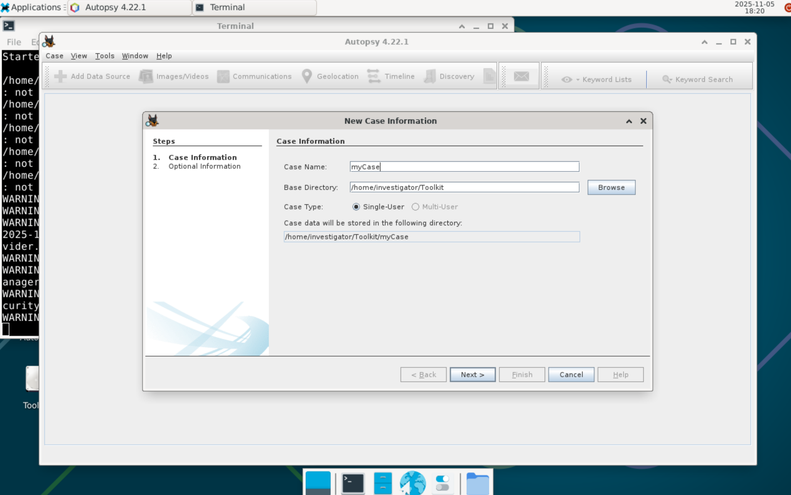
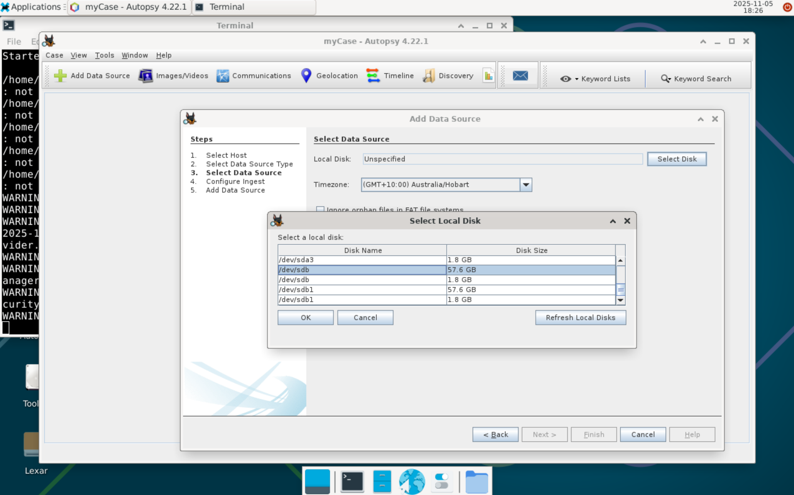
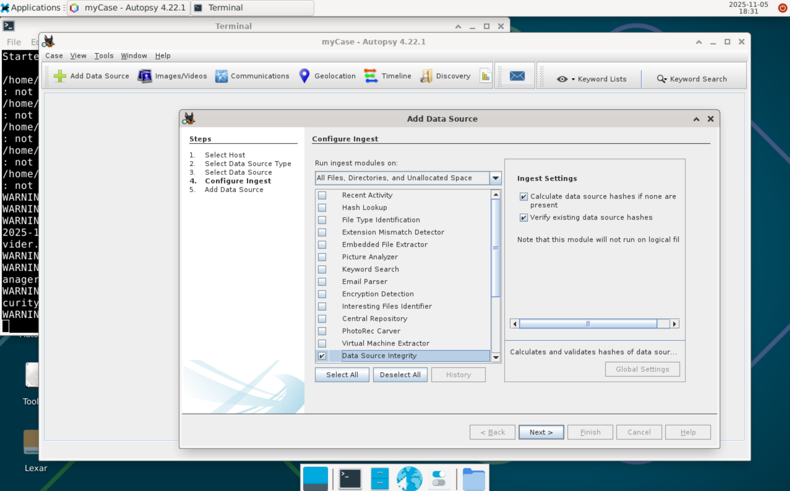
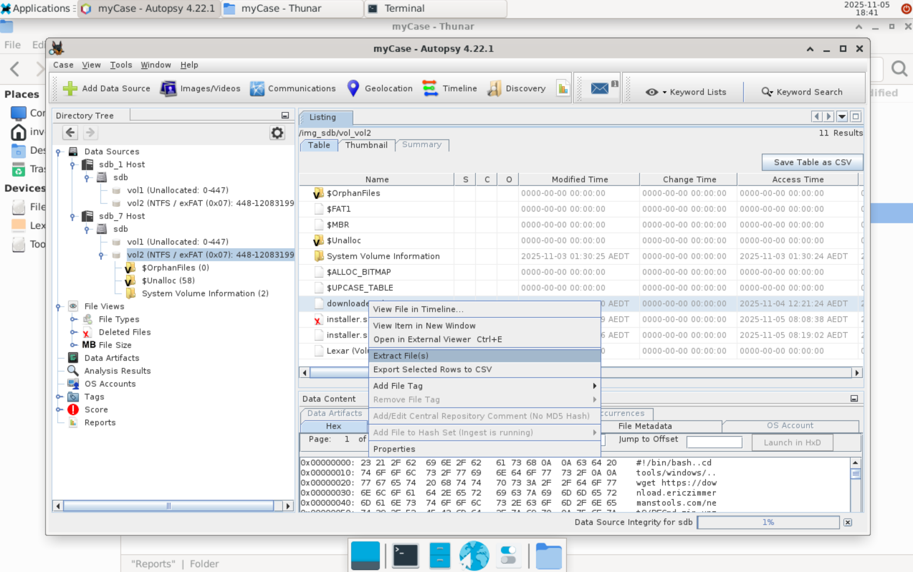

# Autopsy Usage Guide

Version: 4.22.1
https://github.com/sleuthkit/autopsy/releases

Autopsy is a digital forensics suite designed to search and analyse .

Autopsy is accessible from a desktop shortcut on the bootable Linux environment of the drive. The user password ('investigator') will be requested to allow running with access to disks.

Work is stored in a "case", using a directory tree and database. Exported files and reports will be contained within their respective subdirectories. Generated reports may be of several formats, but HTML is generally preferred.

## Step-by-step walkthrough

1. Log into the toolkit's Linux OS and launch Autopsy with the shortcut on the desktop.
2. Create a new case, or open an existing one. It is recommended to create a new case for each target machine, and to store cases in the ExFAT 'Toolkit' partition for portability.

3. Click 'Add Data Source' in the top left to begin adding a drive to analyse. In most instances where the portable toolkit is used, you will be adding a Local Disk from the target machine as the data source, though images generated by Guymager or specific folders are also valid sources. If selecting a local disk, you may select specific partitions or the entire disk.

4. Configure which ingest modules to run initially. Some modules can take a long time to finish or use large amounts of memory, so if you are in a hurry or the target machine has older components, consider only running necessary modules first; Additional modules can be run later if needed. Of particular interest to initial evidence acquisitions are the 'Recent Activity', 'Encryption Detection' and 'PhotoRec Carver' modules. It is recommended to always use the 'Data Source Integrity' module.

5. Once the ingest modules have finished, your next steps will depend on both your investigation goals and findings on the target machine; Consult the [official autopsy documentation](https://sleuthkit.org/autopsy/docs/user-docs/4.22.0//) for further pointers.

6. One common task will be exporting files from the target machine. To do this, browse through the data source in the file tree on the left to locate target files, then right-click the desired file and select 'Export file'. Exported files can be found in the 'Export' folder of the case.

7. To generate a report of your findings, then click the 'Generate Report' button on the top ribbon. The HTML format is generally a good choice. Specific results and files can be tagged by right clicking them, allowing the report to be focused on important information only. Reports can be found in the 'reports' folder of the generated case.