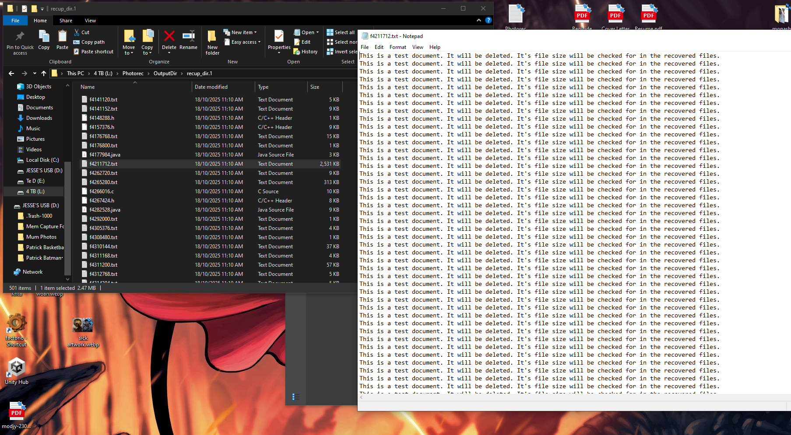
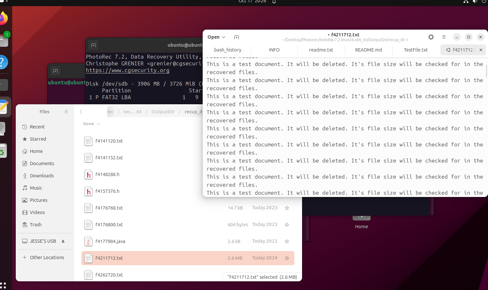
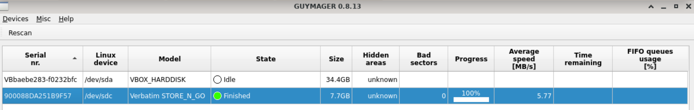
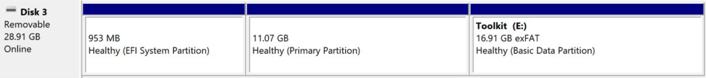
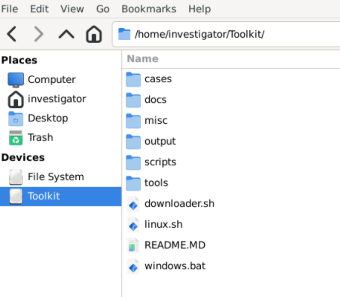

# Final Report KIT325 Assignment Task 3

## Brief Introduction

The goal of this project was to create a lightweight, portable forensics toolkit situated on a USB storage device. When defining the scope, we decided to base the toolkit around being acquisition focused, designed to capture evidence in the field and bring it to a larger workstation for further analysis and reporting with a user's preferred tools. For this scope, we outlined the core functionality we needed from tools, being memory capture, disk imaging, registry analysis, file carving, and file acquisition. We decided to include tools for both Windows and Linux target devices, and a bootable Linux environment for inactive devices, to make the toolkit as widely applicable as possible. This report highlights the finer details of the project, explaining tool selection, testing results in regards to the SPDA document, usability observations, limitations, and future recommendations for the created toolkit.

## Rationale for Tool Selection

### WinPmem and AVML

WinPmem and AVML were selected as our memory capturing tools for Windows and Linux systems respectively. AVML was chosen as it is an open-source, highly portable tool for capturing memory from Linux systems, distributable as a single static binary and outputting memory dumps in a suitable file format. While AVML has some comparable alternatives, WinPmem is one of very few Windows-based memory capturing tools that was legally redistributable. Other tools were considered, but could not be used primarily because of such licensing concerns, such as FTK Imager, MAGNET RAM, FEX Memory Imager and more. This left us with WinPmem as essentially the only suitable tool we could find, but it fitted the needs of the toolkit even if it outputs the resulting memory file in the .raw format instead of the more widely-used LiME format.

### Photorec

Photorec was chosen as our designated file carving option for a few key reasons. Firstly, whilst looking around for available options, Photorec appeared to be the standard recommendation, and commonly appeared amongst the options. It is also an open source tool, letting us use it without licensing concern in this project, and is already an ingest module integrated into autopsy, another tool we planned on using. When looked further into it, the tool seemed sufficiently capable for our needs and easy to integrate into the toolkit, and worked on both Windows and Linux operating systems. As such, we chose it to be tested first as our file carving tool. 

### NTFSTools and dd

NTFSTools was selected as the Windows file acquisition tool due to its ability to directly access NTFS filesystem structures at a low level, including the Master File Table (MFT), alternate data streams, and deleted file recovery. Its open-source nature and comprehensive feature set made it ideal for extracting individual files and system artifacts without mounting drives, which is crucial for forensic integrity.

For Linux systems, dd was chosen as the standard disk imaging tool due to its universal availability, reliability, and simplicity. As a core Unix utility, dd provides bit-for-bit copying of drives and partitions without requiring additional installations. Combined with standard Linux tools, it offers robust capabilities for both full disk imaging and individual file acquisition across various filesystem types.

### System Information Collection Scripts

Rather than relying on third-party tools, custom system information collection scripts were developed for both Windows and Linux environments. This approach was chosen to provide quick and comprehensive evidence gathering when time with the target system is limited. The scripts automate the collection of essential system context including running processes, network connections, user accounts, services, installed software, and hardware information. By creating a purpose-built solution, we ensured the toolkit could rapidly gather critical forensic context without dependencies on external tools, making it ideal for time-sensitive field acquisitions where understanding the system state is crucial for proper evidence interpretation.

## Testing Results

### Main Menu Script
The main scripts were written for both platforms and are able to be used across a wide range of systems. Both platforms detected whether administrator privileges were active or not and displayed appropriate warnings when run without elevated rights. All six menu options were tested, with each option successfully launching its corresponding tool and returning to the main menu upon completion.  

### Memory Capture Tools

Both WinPmem and AVML managed to produce dumps of system memory while running from standard folders on testing systems. A virtual machine was used to test AVML, which still performed as expected in this environment. As suggested during the second progress meeting, Volatility 3 was used to check that the outputted dump files are readable by memory analysis tools, and are useful for further examination. When running a simple windows.info check on both the dump files, the tool correctly displayed information on their contents, showing that they were suitable for use.

Due to the lack of a suitably large USB drive during portability testing, the tools were only checked to have started creating a memory file instead of running to completion. WinPmem worked without issue, successfully running on and creating a memory capture on a USB drive, up until the drive ran out of space. AVML had some initial complications due to the drive being formatted FAT32, which does not have UNIX permission bits. By changing the AVML file name to avml.exe so that it is displayed as executable with the 'showexec' drive mount option, and calling it through the dynamic linker (/lib64/ld-linux-x86-64.so.2), AVML was also able to create a memory capture until the drive ran out of storage. 

### Photorec

From the SPDA document, the main testing criteria for Photorec is for the tool to be able to reconstruct files from unallocated space that match the contents of their original version. It was decided to test on both Windows and Linux systems and when operating from a USB drive, to ensure compatibility as well. For the first test, a sample text file was created with an identifiable size and with easily recognisable contents. Once deleted, Photorec was able to recover the file and match it’s original content on both systems without issue, matching the files length and contents.

*Above are the successfully recovered files from Photorec*

### dd and NTFSTools

The file acquisition tools were tested on both Windows and Linux systems to verify their ability to extract and/or recover files from the system, while preserving metadata and generating initial forensic field reports. On Windows, the script was tested using ntfstools to extract system registry files from a test volume, successfully retrieving the files with complete metadata documentation, including timestamps, extraction paths in separate output directories. The MFT analysis feature was validated by dumping the master file table to CSV format, which accurately catalogued file entries, though ntfstools occasionally exhibited limitations detecting all files on the volume that were confirmed to exist through Windows Explorer. The undelete function successfully recovered a previously deleted test image by its inode number, with content intact, though some files on an MBR partition could not be recovered, suggesting ntfstools may have incomplete coverage of the file system. On Linux, dd was used to create disk images successfully, with automatic MD5/SHA256 hash generation for integrity verification. The individual file extraction feature was validated by copying a test directory containing various file types, with rsync successfully preserving all timestamps and other metadata. File system analysis collected essential information into a report, such as directory structure, file types and key large files. Overall, both tools demonstrated core functionality for file acquisition and analysis, though ntfstools showed some limitations in file detection and recovery coverage on Windows volumes.

### Bootable Linux Environment

The bootable OS included in the toolkit was able to boot on real hardware. Secure boot did not need to be deactivated. By default, no non-toolkit partitions are mounted within the bootable OS, as Guymager and Autopsy are both capable of functioning on block devices, preventing accidental alteration of data on the target machine. Non-toolkit partitions *may* be mounted by the user if necessary, but as doing this is out-of-scope for the toolkit's intended operations it is left up to the user to act appropriately.

### Guymager and Autopsy

In testing the bootable environment, Guymager was able to create a dd image of a USB flash drive, which was then able to be opened and browsed in Autopsy as a data source. matching the original drive. This demonstrates that both tools are functional as installed in the toolkit, and satisfies the test case in the SPDA document. It was noted that attempting to create and open an E01 image would cause Autopsy to crash; Due to the opaqueness and complexity of the resulting crash log the cause of this could not be determined or resolved, however given the portable toolkit is unlikely to be used to analyse disk image files, only create images or analyse original disks, this is considered a minor issue.

### Distribution

After flashing the raw disk image of the bootable environment to a suitable USB drive using Balena Etcher, the toolkit could be booted. The installer script was able to create a new, labelled ExFAT partition in the remaining space on the drive containing this git repo, and the downloader script successfully downloaded and unpacked all remaining tools into their respective folders. This is verifiable by viewing the partition layout with the "lsblk" command on Linux or the Windows Partition Viewer, and inspecting the folder structure to verify all expected files are present. After an initial install on a USB 2.0 drive it was discovered that such a drive is too slow to properly operate a graphical desktop environment; A note was added to the README clarifying minimum drive specifications.

### Scripting

Scripting is a large component of the toolkit, intended to streamline the use of tools and provide an easy and simple interface for users to use the toolkit from. We created several wrapper scripts for each of the individual tools, as well as a pair of master scripts (one for each Linux and Windows respectively) to call upon these tool wrappers, letting all the evidence acquisition be done from this one interface point. This script also handles the output of the tools, providing subdirectories for each tool and timestamps to help categorise and sort evidence. 

Checksum hashing scripts were also made to generate hashes of the output files, saving them in a sha256 file alongside the output. This was done so the integrity of these files can be verified at later investigation stages, and is called whenever the main script attempts to exit on either versions. 

## Packaging Decisions

To enable tools for live systems to exist alongside a bootable environment, the toolkit needed to be divided into two main partitions. One to provide the bootable Linux environment, and one to house the tools and scripts so that they are accessible to other machines. The tools partition is formatted using the ExFAT filesystem, as it provides read/write capabilities under both Linux from kernel 5.4 onwards and Windows from Vista onwards, providing good cross-platform compatibility. FAT32 was not used due to its 4GB file size limit, which would prevent disk imaging or memory capture in most cases. The tools themselves are downloaded by a script during install time instead of being packaged, to allow for easier updating or customised deployments, as well as to avoid potential redistribution licensing issues, at the cost of requiring internet access during install.

Since the bootable partition would need to be flashed to a USB drive with a flashing tool manually in any case, it was decided to automate the creation of the tools partition using a script within the bootable partition to make installation easier and more stable, since it is performed from the same environment regardless of the user's regular OS. The bootable partition itself would therefore be the only thing a user would need to manually download and install, the process of which is made very simple with tools like Balena Etcher, Rufus or Impression. The bootable partition is installed as a raw disk image, instead of an ISO image, allowing it to be read/write after install. This enables in-place upgrades and persistent storage of a user's documents and additional tools, enabling installations to be further custom-tailored.

## Usability Observations

The toolkit makes the process of acquiring forensic evidence from physically accessible machines much smoother and easier, whilst providing thorough documentation on the usage and capabilities of the tools contained. This package ensures that the process of acquiring evidence whilst adhering to government or company policies is a more convenient and approachable process, whether used in field work, for private use or for educational purposes. There is the possibility that a bad actor could try and make use of the toolkit to steal sensitive data from a device, however the need for physical access to deploy the toolkit makes misuse or amoral actions using the toolkit difficult and potentially dangerous, so it is unlikely to meaningfully increase the risk of the tools being abused. 

Economically, the tools contained are all open source or freely available, making forensic work more accessible to small businesses or individual users who may lack the resources to pay for commercial tools. This also ensures legal concerns for whoever may use the toolkit are minimised, at least in regards to the packaged tools. Alongside being freely available, the documentation and scripts provided can help guide less experienced users in using the tools for smaller investigations without having to resort to contracting a professional at high expense. 

## Limitations and Future Recommendations

One limitation the toolkit faces is the need for privileged execution for many tools to work. As discovered during testing, many important system files one might wish to acquire, and access to raw disk and memory interfaces, require tools to be run as administrator on Windows or root on Linux, creating a potential obstacle for users. While this could be theoretically addressed through the use of privilege escalation exploits, this would raise significant ethical questions and require constant research and updates to maintain. Realistically, in the case of educators or small businesses applying the toolkit ethically and with authorisation, privileged execution should be available anyway.

The bootable Linux environment also faces potential system access challenges, in the form of disk encryption. If the target machine's disk is encrypted with a strong key that isn't known to the toolkit user, then meaningful analysis becomes essentially impossible. Again, an authorised user acting within ethical boundaries should have access to a decryption key, but this is an obstacle that a user would need to be aware of.

Another potential practical issue is USB storage space. While the bootable environment could be configured to make use of network-attached storage, doing such on a live target machine would be a significant contamination of evidence; To mantain a reasonable degree of forensic integrity, only the drive's storage or another external drive should be used for storage of acquired evidence, and physical limitations on the amount of data that can be stored may become an issue if attempting to acquire a large amount of evidence, such as from a storage server. In these cases, using the bootable environment or even physically acquiring the disks may be a better option, though transferring files from a live target over a temporary connection like SSH may be acceptable to some users if properly logged.

Finally, the toolkit has some limitations with regards to device compatibility. Both Windows and Linux targets are within the toolkit's operational scope, but this scope is currently mainly limited to modern x86_64 UEFI systems. While this applies to most consumer and enterprise workstations and servers currently in use, older systems without 64-bit support or using Master Boot Record partitioning exclusively, as well as modern systems using ARM, RISC-V or other less common processor architectures will be unable to take advantage of most of the functions included in the toolkit. 32-bit support could be partially implemented by including the 32-bit versions of tools, where available; This is demonstrated with NTFSTools in the toolkit, and could be extended to include other tools as well. Support for alternate CPU architectures, or 32-bit support for the bootable environment, would require essentially fully rebuilding the toolkit from the ground up, as the bootable environment would need to be recreated on the new architecture and many tools would need to be replaced. Support for BIOS/MBR systems could be added by converting the system's current protective MBR into a full MBR alongside the GUID Partition Table, allowing older systems to access the toolkit as well. 