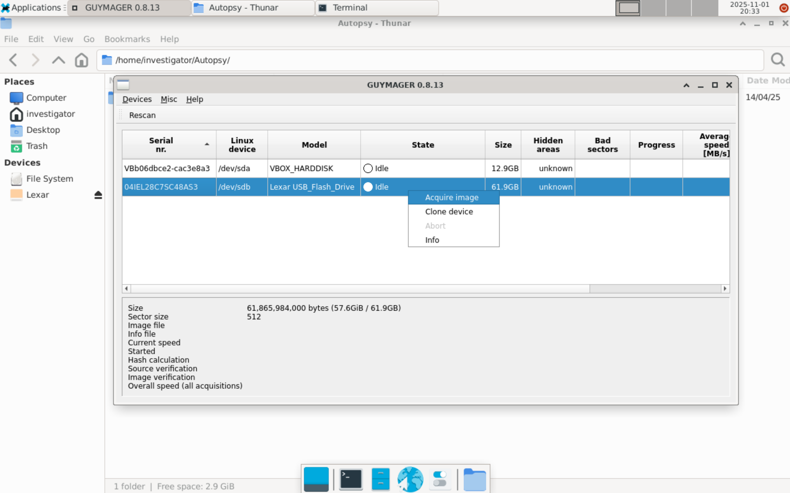
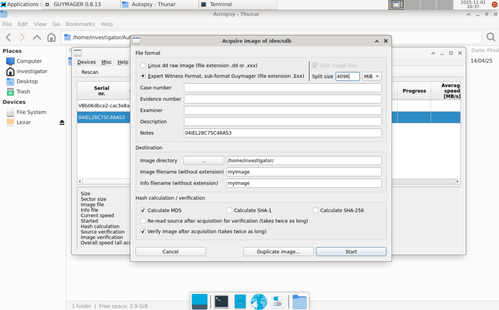
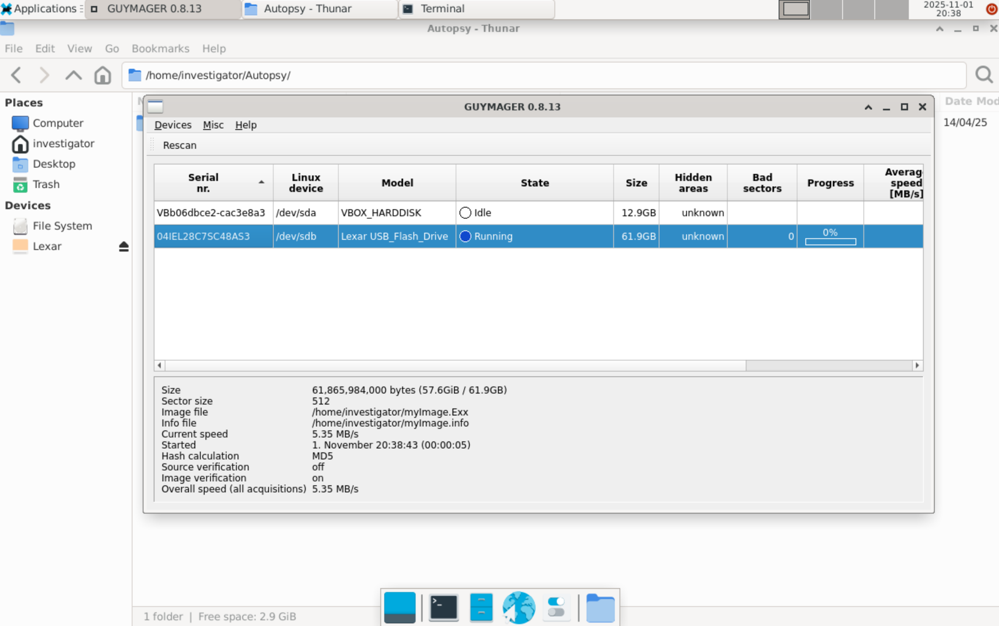

# Guymager Usage Guide

Version: 0.8.13
https://packages.debian.org/stable/guymager

Guymager is a disk imaging tool, used to create images (copies) of selected storage drives for storage, transport and later analysis.

Guymager is accessible from a desktop shortcut on the bootable Linux environment of the drive. The user password ('investigator') will be requested to allow running with access to disks.

Output images may be in raw format (.dd) or Expert Witness Format (.E01, .E02, etc.)

## Note on Image Size
Given the size of produced disk images (given a functional computer's primary drive as a target) will likely exceed the storage capacity of whatever portable medium the toolkit is installed on, it is recommended to make use of a second external storage device with sufficient capacity to store an image of the target disk, or configure a remote storage location accessible to the toolkit's OS over a network. It is expected that the user will configure this prior to imaging, as available hardware and network storage locations will vary.

## Step-by-step walkthrough

1. Log into the toolkit's Linux OS and launch Guymager with the shortcut on the desktop.
2. Identify the drive to be imaged in the drive list; Right click and select 'Acquire image'.

3. Select desired options for the output image. Generally, Expert Witness Format (EWF) is recommended, as it allows for the use of compression to reduce image size. The number of EWF files produced will be determined based on the split size options. Ensure the Image directory selected has sufficient space, see 'Note on Image Size' above. It is recommended to enable calculation of an MD5 hash and image verification to ensure forensic integrity.

4. Click 'Start' and wait for the imaging process to complete.

