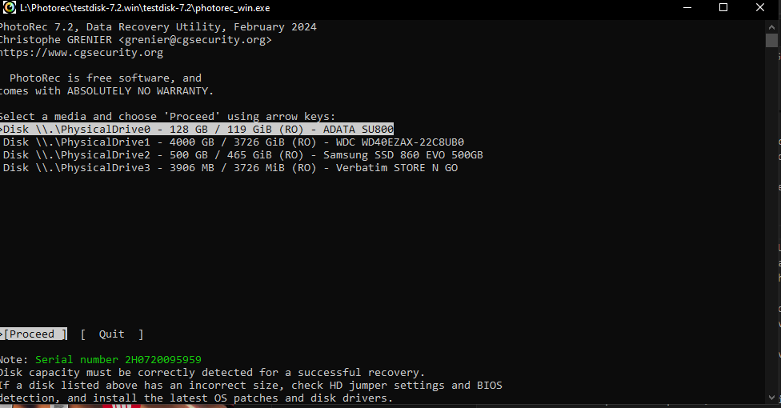
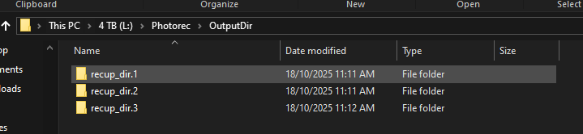

# Photorec Usage Guide

Version: TestDisk & PhotoRec 7.2
https://www.cgsecurity.org/wiki/TestDisk_Download

Photorec is a file carving tool used to acquire and restore deleted file remnants from linux and windows operatin systems. 

Photorec can be run from the master script. If this is desired, please use the Master Script usage guide instead. Below is a walkthrough on how to run the tool on the USB drive without the use of a script.

## Step-by-step walkthrough

### Linux Version

The tool can be run from the command line. Once the tool has been opened, the process for running is identical
to the windows version.

1. Open terminal and locate the "photorec_static" file within the linux section of the USB drive.
2. Run the tool with the command "./photorec_static"
3. this will display the tool within the terminal interface. See the corrosponding image under step 3 of the windows version walkthough.
4. Continue from step 4 of the windows version walkthrough.

### Windows Version

1. within the tools folder on the USB drive, locate the file "photorec_win.exe"
2. Right click the file and select "Run as Administrator"
3. A command prompt window will open with the instructions from the tool displayed. Alternatively, enter the tools directory from command prompt (run as administrator), and run the executable from there.

4. Select the drive partition you wish to search for, using arrow keys and enter to select.
5. Select the filesystem type of the drive. You can *usually* press enter straight away when this prompt appears.
6. Select whether all the space needs to be searched, or just unallocated space.
7. Select the directory to save the recovered files to.

If these steps are completed, restored files will be placed within the provided output directory on the USB drive and available for further investigation.

## Troubleshooting

If a 'partial install' has been used instead of a full install, and the USB was formatted to FAT32 instead of ExFAT, the photorec_static binary will not be executable, as FAT32 does not have permission bits. In this case, reformat the drive and reinstall the toolkit.